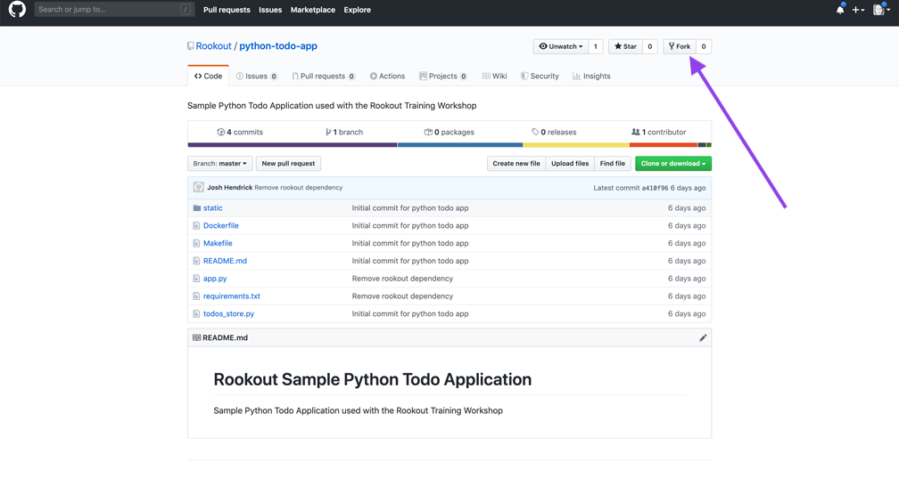
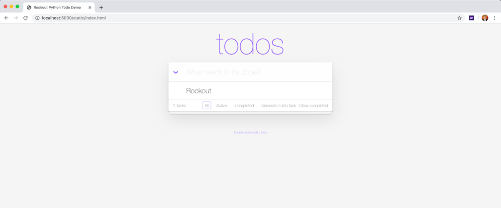
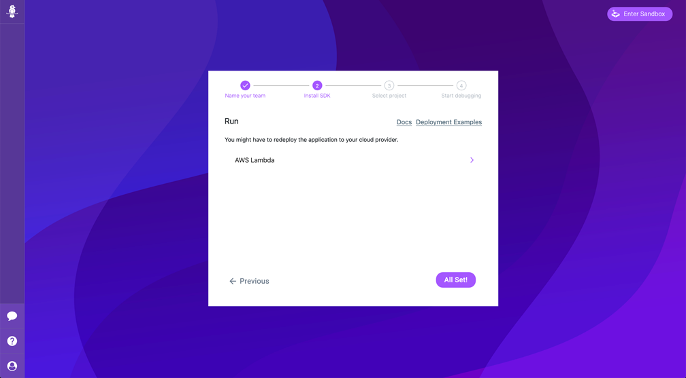

# Configuring the Rookout SDK

This section of the workshop will take you through how to setup the [Rookout SDK](https://docs.rookout.com/docs/python-setup.html) in a sample Python [Flask](https://www.palletsprojects.com/p/flask/) application.  The application is a simple web based To-Do app which allows you to add and delete items from a list.  In this case, we're going to be running the application locally, but Rookout can work anywhere you have your application deployed including **Test** and **Production** environments.

In this case we'll be using Python, but Rookout also supports Node.js, any JVM based language including Java, and .NET.  For more details on the setup process for other languages, visit the Rookout documentation available at https://docs.rookout.com

Before beginning this section, make sure you've created a Rookout account as described on the [Setup page](./setup.md) Let's get started:

1. To start, you'll need to fork the **python-todo-app** repository - https://github.com/Rookout/python-todo-app - into your GitHub account so that you can add the Rookout SDK and then commit those changes.  If you haven't forked a repository before, click on the fork button as shown in the image below.

<p><p>

2. Next, open up a command line interface and clone the To-Do app repository which you just forked: ```https://github.com/<your-github-username>/python-todo-app```.  For example:

    ```
    git clone https://github.com/jhendrick/python-todo-app
    ```

2. Before making any changes to the application, ensure that you can run the application locally by building the Docker image and then running the container:

    a. cd to the **python-todo-app** directory and run one of the following commands:

    ```
    make build
    ```
    or
    ```
    docker build --tag rookout/tutorial-python:latest .
    ```
    
3. Next, run the container using the following command:

    ```
    docker run -p 5000:5000 rookout/tutorial-python
    ```

4. You should be able to access the To-Do app at http://localhost:5000.  You can experiment with adding and removing items from the To-Do list.  After you're done, stop the application.

<p><p>

5. Now that you know the application runs successfully, let's configure the [Rookout SDK](https://docs.rookout.com/docs/python-setup.html).  First, let's add the [**rook package**](https://pypi.org/project/rook/) as a dependency to the application by adding it to our **requirements.txt** file:
    ```
    flask>=1.0,<=2.0
    requests
    rook
    ``` 

6. Save the **requirements.txt** file.  Next, we need to import the **rook package** into the application.  Open the *app.py* file in the root directory of the repository and add the following line towards the top of the file:
    ```
    from rook import auto_start
    ```

    For example, you may want to add it after the set of existing imports like this:
    ```
    import flask
    import re
    import os
    import string
    import random
    import json
    import requests

    from datetime import datetime
    from random import randint
    from todos_store import Store

    from rook import auto_start

    app = flask.Flask(__name__, static_url_path='/static')
    ```

7. Finally, we'll need to set the [Rookout Token](https://docs.rookout.com/docs/python-setup.html#sdk-api) as an environment variable before we restart our application.  From the command line set the following environment variable:
    ```
    export ROOKOUT_TOKEN=<Your Rookout Token>
    ```
    > Note: When you signed up for your Rookout account in the [Setup](./setup.md) section you should have gotten a token which you will set in the above environment variable.

8. That's it, now we're ready to re-build the Docker image and then start the application again by running one of the following commands:

    ```
    make build
    ```
    or
    ```
    docker build --tag rookout/tutorial-python:latest .
    ```

    After the build completes, you can run the application again by running:

    ```
    make run
    ```
    or
    ```
    docker run -p 5000:5000 -e "ROOKOUT_TOKEN=${ROOKOUT_TOKEN}" -e "ROOKOUT_LABELS=env:dev" rookout/tutorial-python
    ```
    > Note: We're also setting a [Rookout Label](https://docs.rookout.com/docs/projects-labels.html) which is a key/value pair that can be used from within Rookout to filter different application instances. We'll talk more about this in a later section.

9.  You should now be able to navigate back to http://localhost:5000 and see your application running again.

10.  Finally, when you navigate back to the **Rookout Wizard** you should see the **Waiting for SDK Connection** button display **All Set!**.

<p><p>

11.  Finally, commit your code changes back to your GitHub repo:

```
git add -A
git commit -m "Added Rookout SDK"
git push
```

Congratulations! You've configured the Rookout SDK and are now ready to connect your sources in the next section.  Click on the link to proceed to [Section 2 - Connecting Sources and Exploring the Rookout App](./sources-rookout-app.md).