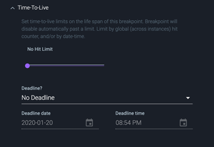

# Editing Rookout Non-Breaking Breakpoints

In the last section we looked at how to set a **Non-Breaking Breakpoint** within the To-Do application.  In this section we'll dive deeper into editing breakpoints.  This section will introduce the following topics:

* Configuring **Conditional Breakpoints** which will trigger Rookout to collect a snapshot only when specific conditions are met
* Using the **Time-to-Live** functionality to determine the *life span* of a breakpoint
* Adjusting the **collection depth** of a breakpoint

Let's get started:

1.  In the **Message Data** window which was reviewed in the last section, find the **todoStr** variable in the list of local variables.  The value should contain the string you added to your To-Do list.  In this case, the value is **Rookout**.

    

    Right click on the **todoStr** variable and select **Set as Condition**.  This will automatically create a condition in the breakpoint which will cause Rookout to collect data only when the **todoStr** is equal to the value **Rookout**.

    

2.  Let's see how we can further configure and edit the conditional which we just created.  Click on the **Edit BP** tab.  This will bring up the **Edit Breakpoint** view.  Notice the condition we just created is listed within the **Condition** section.  Click on the **Condtion** section to expand the **Condition View**.

    

3.  Within the **Condition View** the conditional that we just created can be configured.  You can adjust the comparison operator as well as the string to compare.  Notice that you can also create an **Advanced** conditional by clicking on the **Simple / Advanced** toggle where you can combine multiple logical expressions separated by && or ||.

    

    Add a different item to the To-Do list.  Notice that you do not get another message in the message pane.  Now add another item that matches your conditional string.  You should get a second message.

4.  Next let's look at **Time-To-Live**.  Click on and expand the **Time-To-Live** section below the **Condition** section.

    

    The **Time-To-Live** functionality lets you configure the life span of the breakpoint before it is automatically disabled.  The life span can be configured based on the number of times the breakpoint is triggered via the **Hit Limit** slider or based on a specific deadline which can be configured based on a specific date/time. 

    > Note: If Hit Limit is used, the breakpoint will be automatically disabled when the hit limit passes the configured limit.  For example, if the hit limit is 2, when the breakpoint is triggered a 3rd time the breakpoint will be automatically disabled.

5.  Set a hit limit of 2 and click on the **Set** button at the bottom of the **Edit BP** section to save the breakpoint configuration.  Now, from the To-Do app, add 3 items to the list with the same name as your Conditional value.

6.  Switch back to Rookout and click on the **Breakpoint** tab from the left hand panel.  Notice that the breakpoint is no longer solid purple, it's turned hollow gray.  This means that the breakpoint was automatically disabled based on the **Time-To-Live**.

    Re-enable the breakpoint by clicking on the three dots next to the disabled breakpoint and select **Enable**.

    

7.  Click on the three dots again next to the breakpoint and select **Edit Breakpoint**.  Expand the **Condition** section and disable the **Time-To-Live** by moving the **Hit Limit** slider to **No Hit Limit**.  Click **Set** at the bottom of the **Edit BP** section to save the changes.

8.  Finally, let's look at how the local **variable collection depth** can be adjusted within the breakpoint.

    > ### Understanding Collection Depth
    > Your code may generate resource heavy snapshot data, for example the collected data from your application may contain many levels of nested arrays or objects.  To make sure performance isn't impacted, Rookout sets some limits on how deep in the stack data is fetched.  In some cases you may see the message **Max depth has been reached** which tells you that Rookout didn't collect these variables because the maximum collection depth has been reached.
    
    > For more details you can review this section of the Rookout documentation: https://docs.rookout.com/docs/breakpoints-reference/#object-namespace

    The collection depth can be adjusted from within the **Collection** section of the **Edit BP** tab.  Click on the **Collection** section to expand it.

    

9. Click on the **Collect Locals** drop down box:

    

    There are four main settings which can be configured here:

    * Don't collect local variables
    * Slim collection of local variables
    * Collect local variables
    * Extended collection of local variables

    As the names suggest, each represents collection of variables that goes deeper or shallower in the stack.  Feel free to play around with the different settings.  In this example, since we don't have very resource heavy snapshot data you will not see any difference between **Collect local variables** and **Extended collection of local variables**.

You're now ready to move on to [Section 6 - Configuring Rookout Data Targets](./targets.md) where we will explore how you can configure a Rookout Non-Breaking Breakpoint to send collected snapshot data to an external system.