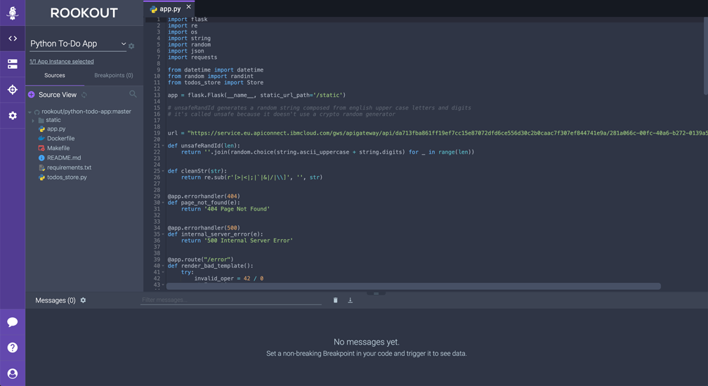
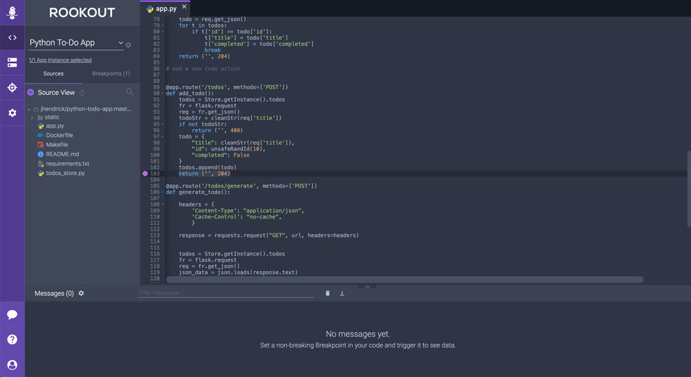
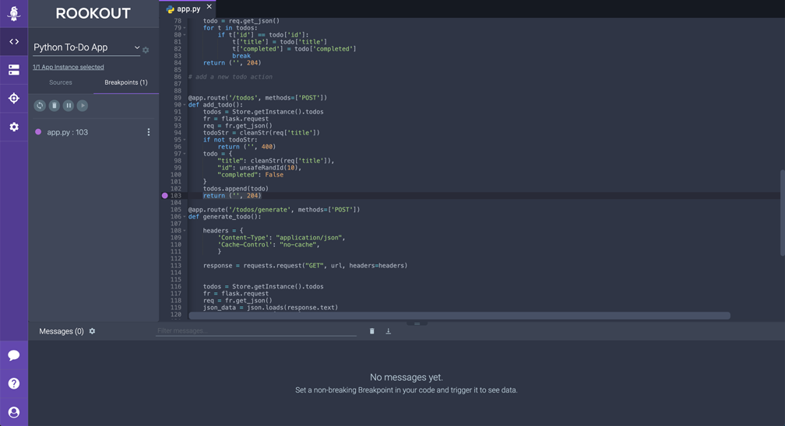
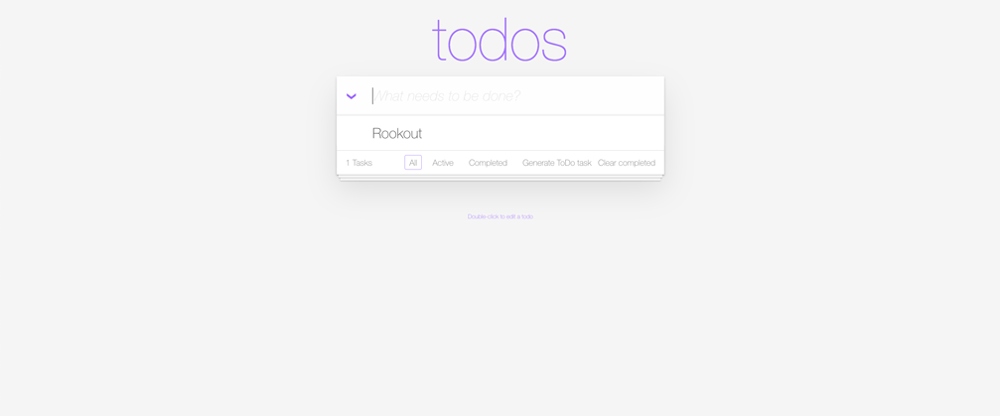
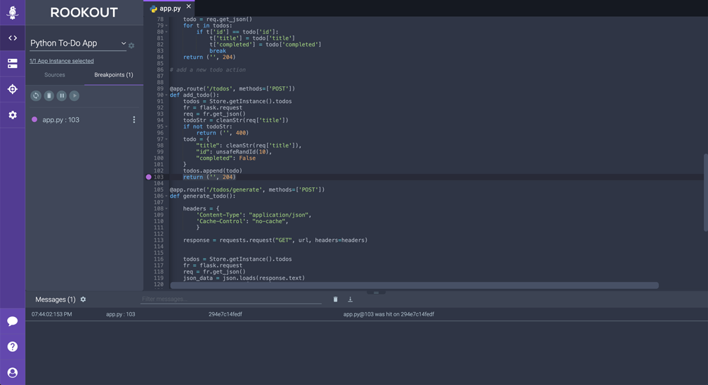
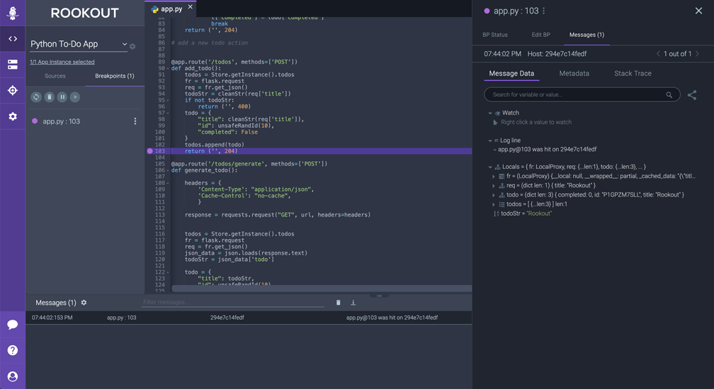

# Setting Non-Breaking Breakpoints

In this section of the workshop we're going to take a look at how you can use Rookout to set a **Non-Breaking Breakpoint** within the To-Do app source code.  Setting **Non-Breaking Breakpoints** is similar to how you would set a breakpoint in your IDE but in this case, the application never stops its execution.  They allow Rookout to capture a snapshot of the underlying state of the application including local variable values, meta data, and a stack trace leading up to where the snapshot was captured.  The great thing is that this can be done in any environment where the application is running (including Staging and Producation) with very minimal performance overhead (about the same as if you were writing log lines yourself within the code).

This section of the workshop will guide you through the following areas:

* Setting a **Non-Breaking Breakpoint** within the To-Do app source code
* Interacting with the To-Do app to trigger the code where the **Non-Breaking Breakpoint** is set
* Reviewing the snapshot data that Rookout collects

Let's get started:

1. From the **Source View** panel on the left side of the screen, expand the source code repository files and click on *app.py* to open it in the **source view panel**.

<p><p>

> Note: You can also open files using the search functionality by clicking on the magnifying glass icon in the **Source View** panel.

2. Let's set a **Non-Breaking Breapoint** that will trigger and collect a snapshot every time we add a new to-do item to our list.  In order to do that, we'll need to find the **add_todo()** method.  The **add_todo()** method starts on line 90.  Let's set a **Non-Breaking Breakpoint** on the last line of the function at line 103.  The line should be:
    ``` 
    return ('', 204)
    ```
    In order to add the **Non-Breaking Breapoint**, click in the column directly to the left of the line number in the file view panel.  If things went as expected, you should see a **solid purple** circle appear which indicates that the **Non-Breaking Breakpoint** has been set.

<p><p>

> Note: If you don't see a solid purple breakpoint, refer to this page of the documentation for additional statuses and their meanings: https://docs.rookout.com/docs/breakpoints-status/

3.  To view all of the currently set breakpoints, click on the **Breakpoints** tab in the left hand panel.  In this case, we see that we have a breakpoint set in *app.py* on line 103.  To view the **status** of the breakpoints or to edit, disable, or delete them, click on the three dots directly to the right of the breakpoint.  We'll dive more into editing breakpoints in the next section.

<p><p>

4.  Now that we have a **Non-Breaking Breapoint** set, let's interact with the To-Do application by adding an item to the list to trigger a snapshot to be collected when line 103 of the code is executed.  Navigate back to your To-Do app at http://localhost:5000/static/index.html and add any to-do item.

<p><p>

5.  Now that we've added a To-Do item, switch back to the Rookout app.  You'll notice that there is one message in the message pane at the bottom of the window.

<p><p>

When line 103 of the application was invoked, Rookout collected data from your application and sent it to the Rookout app so that you can inspect the data in more detail.

> Note: In addition to a fully SaaS based approach, Rookout supports on-prem deployments so that no application data passes outside of your firewall.  Rookout also supports PII Data Redaction where required.

6.  Next, let's inspect the message.  Click on the message from the pane at the bottom.  The **Message Data** window should appear.

<p><p>

From here you can:

* Inspect all the local variable values from within the running application
* View Metadata about the application
* View a full stack trace leading up to the line of code where the breakpoint was set

Take some time to browse the **Message Data** and the other sections.

> Note: If you would like to get a link to share this snapshot with other members of your team, you can click on the **Share** icon on the right side of the Message Data window.

Congratulations, you've successfully set a **Non-Breaking Breakpoint** and collected snapshot data from the running application.  You're now ready to move on to [Section 5 - Editing Non-Breaking Breakpoints](./editing-breakpoints.md) where we will explore how you can start customizing how and when data is collected.