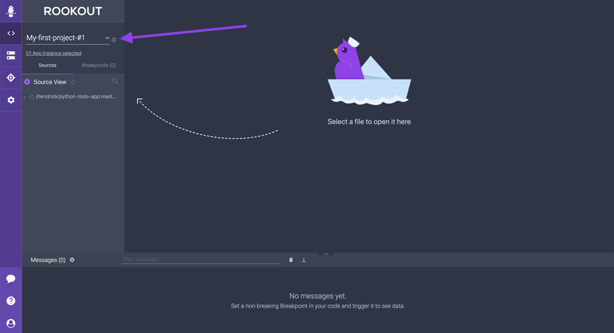
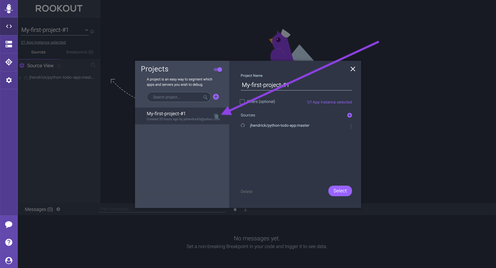
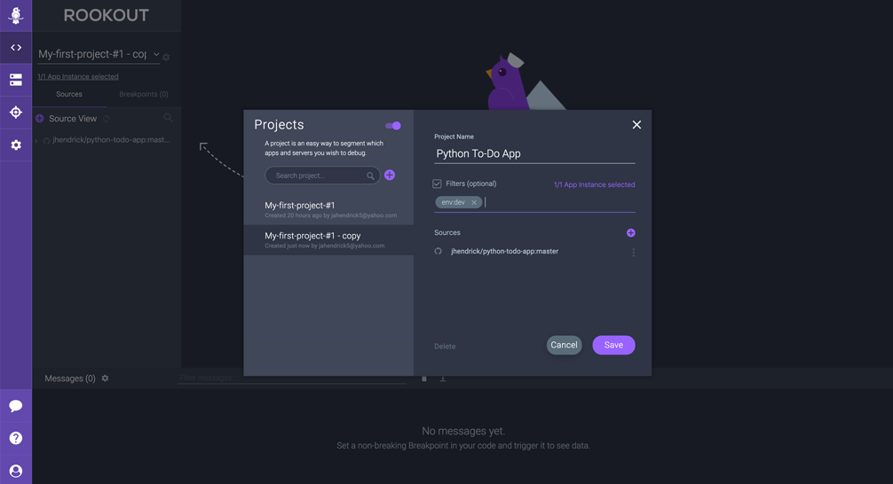

# Projects and Filtering Application Instances

This section of the workshop will take you through the following:

* The benefits of using **Projects** in your teams
* Configuring **Filters** based on the **Label** key/value pair we configured in the prior section

We're almost ready to start setting Non-Breaking Breakpoints, but first lets take a look more in depth at your Rookout project and see how we can configure Rookout to filter different application instances:

1.  From the Purple menu bar on the left side, navigate back to the **Debugger view**.  From here, click on the **gear icon** directly next to your project name **My-first-project-#1**.  This will open the Rookout Projects editor.

2. From the Rookout Projects editor you have the ability to:

    * Create, copy, or delete projects
    * Connect new source code repos or delete existing repos
    * Configure filters

    Rookout projects are beneficial for a few reasons.  First off, they allow you to organize source code repositories together so that you can debug applications from those repositories.  Secondly, when you have multiple developers as part of your Rookout Organization, you can either:
     1) Share **Non-Breaking Breakpoint** snapshot data from your application with other users by exploring that data from the same project at the same time, or 
     2) Separate your **Non-Breaking Breakpoint** data so that users can set breakpoints (even on the same line of code) and get back separate snapshot data.

3.  Let's duplicate and rename our first project.  Hover over your project on the left side of the Projects screan and click the duplicate button to make a copy of your project.

4.  Click on the **My-first-project-#1 - copy** project and rename it to Python To-Do App by changing the project name field on the right side of the screen.

5.  Before we save the project, let's also configure the **Filter** which we configured when we installed the SDK.  A filter is a key/value pair which is attached to a running Application Instance that allows you to tell Rookout which applications you want to debug.  There built in filter types such as **IP Address**, **hostname**, and **process name** but you can also define your own filters.  For example, you may want to create labels called env:dev, env:staging, and env:production so that you can filter application instances deployed to different environments.

    If you remember from the SDK setup section, we created a filter called **env:dev** since we're running this example locally in a development environment.

    Let's check the **Filters** checkbox and type in the name of our filter.  It should automatically appear in the drop down list as you type.  Choose the filter.  Your project screen should now look like the below screenshot.

    

    > Note: In this case we only have one deployed Application Instance so the filter doesn't make a difference. But if we had many Rookout SDK's deployed into our environment, filters would become more important to ensure we get the data from the running application we're looking for.

6.  Click the Save button.  You should see the name of your project change to **Python To-Do App**.

You're now ready to move on to [Section 4 - Creating Non-Breaking Breakpoints](./non-breaking-breakpoints.md) where we will explore how you can start getting data from your live running applications.