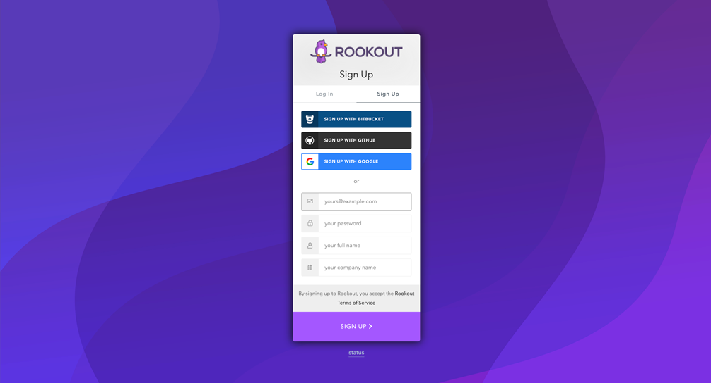
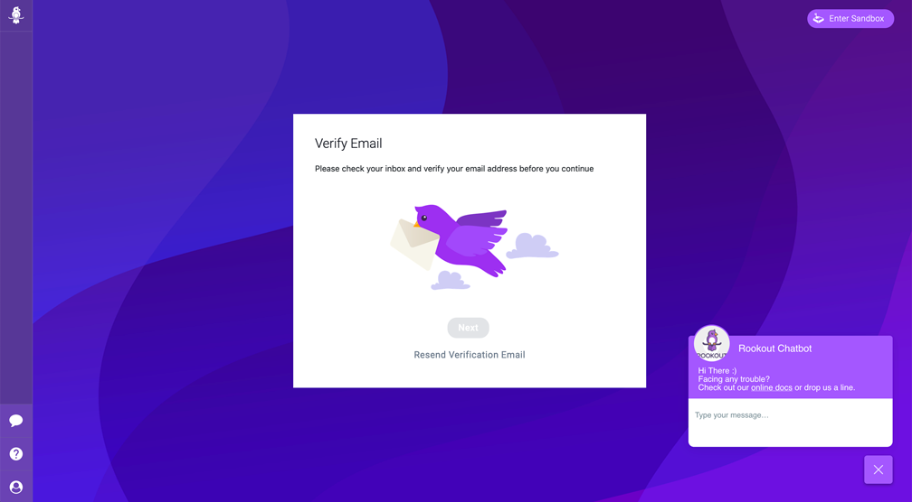
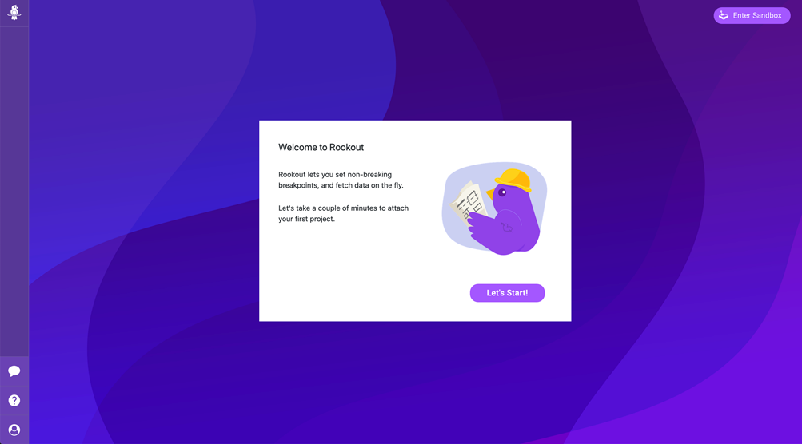
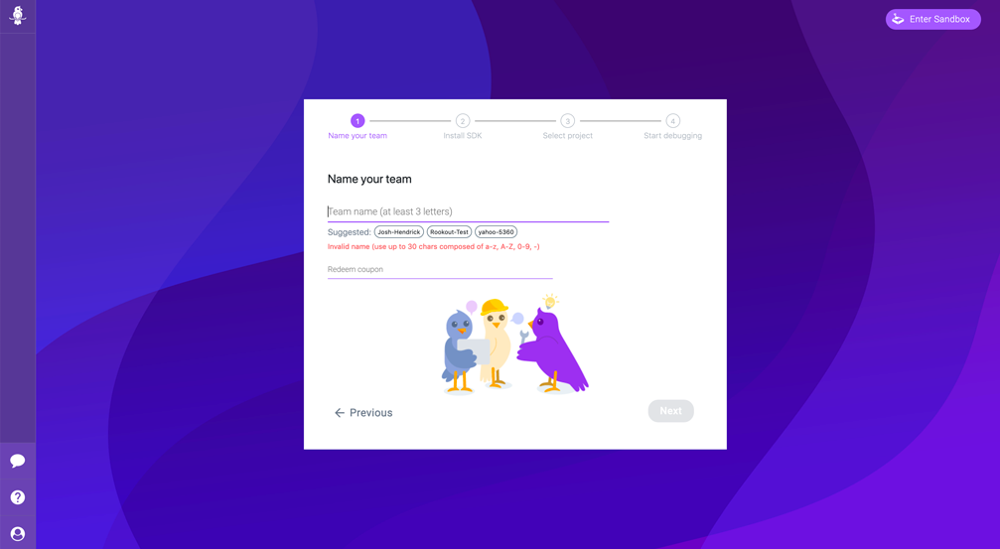
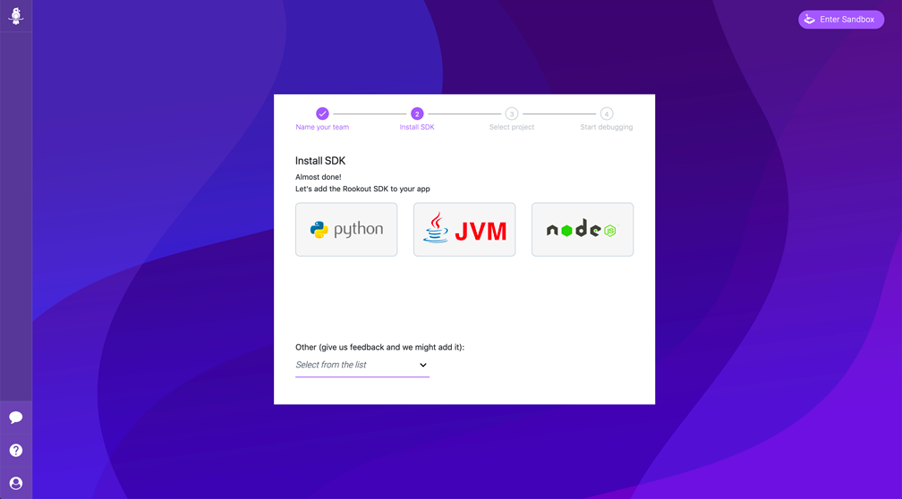
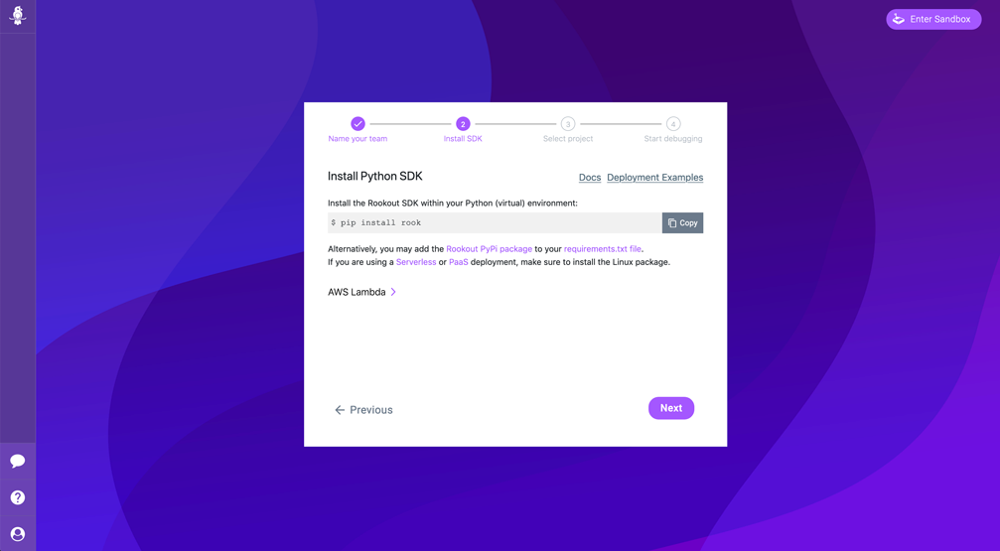
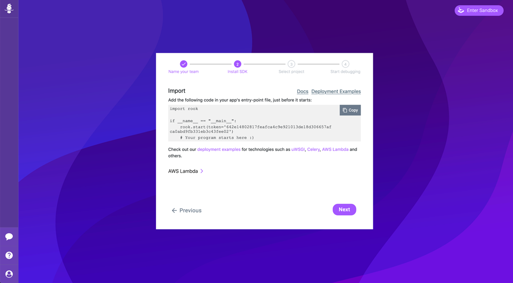
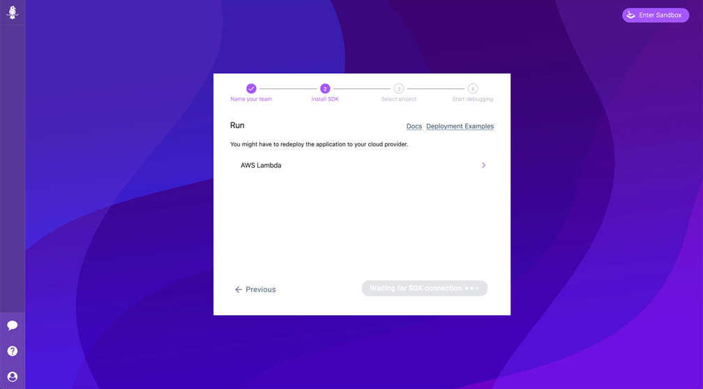

# Rookout Workshop Setup

As discussed on the [README page](./readme.md), the following are requirements to starting the training:

  * An account on GitHub: https://github.com
  * Docker installed locally: https://www.docker.com/get-started
  * An account on Slack: https://slack.com/get-started
  * A Rookout account: https://app.rookout.com/#mode=signUp

  Below is additional information on the initial setup:

## Create a GitHub Account

Sign up for a GitHub account at the link above. You should also have git installed locally on your workstation as you'll be interacting with your GitHub repository from the command line.

## Download and Install Docker Desktop

Download Docker Desktop and install the application.  You should have a basic familiarity with Docker, but detailed instructions are given in case you don't.

## Create a Slack Account

Create an account on Slack.  We'll be using Slack as an integration target in order to send alerts and messages from Rookout to a Slack channel.  You'll need to login to Slack during one of the sections to validate messages were successfully sent to Slack.

## Create a Rookout Account

Create a Rookout account by following the below instructions:

1. Navigate to https://app.rookout.com/#mode=signUp and sign up for a new account using the method of your choice.

2. On Sign up you'll be brought to the Rookout application to confirm your e-mail address.  You should recieve an email link containing a link to confirm your account.
> Note: Rookout recommends you use the [Chrome browser](https://www.google.com/chrome/) for the best experience

3. After verifying your email address you'll be brought to the Rookout wizard which will guide you through the setup process.  Follow the steps by clicking on **Let's Start!**

4. Start by giving your Rookout Organization a name and then click next.  You can ignore the **Redeem coupon** field.

> Note: Rookout uses the concept of **Organizations** to organize the members of a development team so that team members can more easily share and collaborate projects.  You'll learn more about Rookout projects in a later section.

5. Next, you'll have the option to choose the **SDK language** you would like to install.  In this case we're going to choose **Python**

> Note: If you have other languages you would like to see Rookout support, please feel free to give us feedback by choosing the language from the drop down list.

6.  Next, you'll see instructions for installing the SDK that you chose in the previous section.  Feel free to browse through the docs and deployment examples. For now, we'll simply click next as we'll be installing the SDK in one of the later sections.

7. In the next section, you can see an example of how to import Rookout into your application.  Take note of the **Rookout Token**.  For now, copy and paste this token into a notepad on your computer.  We will use this in the next section when we configure the **Rookout SDK** in our To-Do application. 

8. Finally, clicking next, Rookout will begin waiting for your first SDK connection.

You're now ready to proceed to [Section 1 - Configuring the Rookout SDK](./configure-rookout-sdk.md).  

> Note: Upon a successful SDK connection with the Rookout service, you should see the **Waiting for SDK Connection** button turn purple and display **All Set**.  You can then click on the button to be taken to the next step.