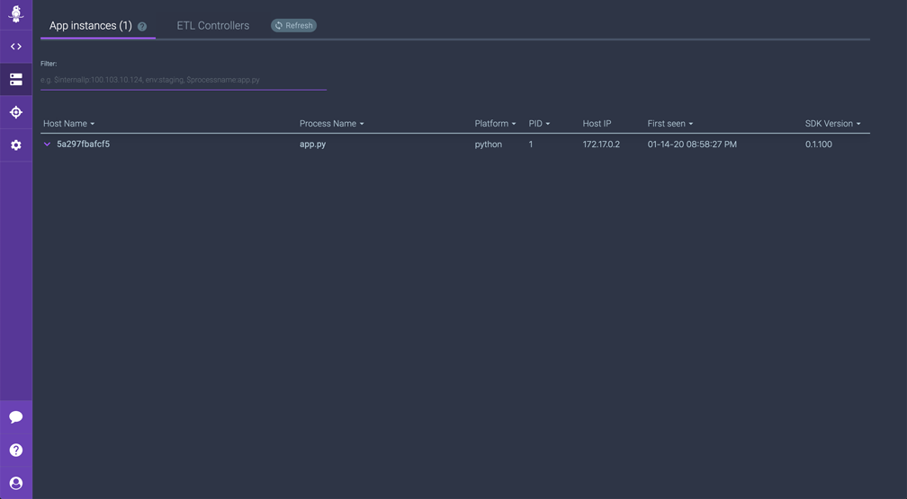

# Connecting Sources and Exploring the Rookout App

This section of the workshop will guide you through the following areas:

* Connecting your source code repository to Rookout
* Exploring your **Rookout Project**
* Exploring your configured **Application Instances**
* Exploring **Rookout Organizations**

Let's get started:

1.  Click on the **All Set** button to be taken to the next screen where we will choose our **source code repository** in order to connect our sources with our Rookout project.

    From this screen choose GitHub as the project repository type:

<p><p>

2.  Next, we'll authenticate with GitHub so that Rookout can connect to your source code repository.  In a later step, you will open your source code files within the **Rookout IDE** in order to set **Non-Breaking Breakpoints**

> Note: Your code never reaches the Rookout servers.  It stays inside your network and the code is only viewable locally from within your browser.  To read more about Rookout Security visit the security page here: https://www.rookout.com/security

<p><p>

3. You will be brought to the GitHub sign in page to authenticate with GitHub.  Input your **GitHub credentials** and Sign In.  Once signed in click the **Connect** button to be taken to the next step.

<p><p>

4.  After connecting successfully, you can choose select the GitHub repository for our sample To-Do application.  You can copy and paste the GitHub repository URL into the field or use the **Advanced Picker** which allows you to choose the **GitHub Organization** and **Repository Name** from a drop down list.  In this case, we can copy and paste in the repository URL and click the **Next** button.

    ```
    https://github.com/jhendrick/python-todo-app
    ```

<p><p>

5.  If everything went as expected, you will see the screen below.  Click the **Start Debugging** button to be taken into your **Rookout Project**.

<p><p>

6.  You should now see your first Rookout project created.  When you initially use the Rookout App, you will see a **popup wizard** which will guide you through setting up a **Non-Breaking Breakpoint**.  Click **Next** to step through the wizard.

<p><p>

7.  Let's quickly get familiar with the Rookout interface before moving onto the next section where we will set our first **Non-Breaking Breakpoint**.

The Rookout interface is divided into a few parts.  The top right side is the **Source View** section where you will view your source code files and set **Non-Breaking Breakpoints**.  The left side is the **Project Configuration** Pane where you can configure your project, sources, and non-breaking breakpoints.  On the bottom, you'll see the **Messages** pane where debug snapshots containing your application data will appear.

On the far left side, there is a **Purple Bar** which contains links to top level views including:

* Debugger
* Application Instances
* Targets
* Organization Settings

8. Click on the **Application Instances** link from the **Purple Bar** on the far left side.  You should see that you now have one Application Instance connected to Rookout.

<p><p>

9. Finally, click on **Organization Settings** from the **Purple Bar** on the far left side.  This is where you can manage users within your organization.  By clicking on the **Invite New Members** button in the top right corner, you can invite additional team members (by email) to join your organization.  This allows developers from your team to share projects and view snapshot data collaboratively from within Rookout.

<p><p>

You're now ready to move on to [Section 3 - Projects and Filtering Application Instances](./projects-filters.md) where we will explore the concept of **Rookout Projects** and see how we can filter **Application Instances** using **Rookout Labels**.