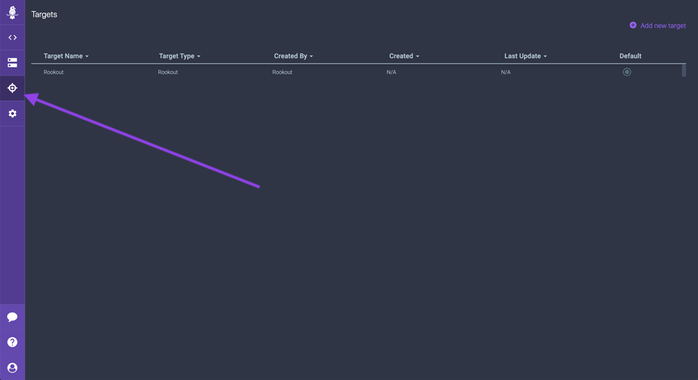
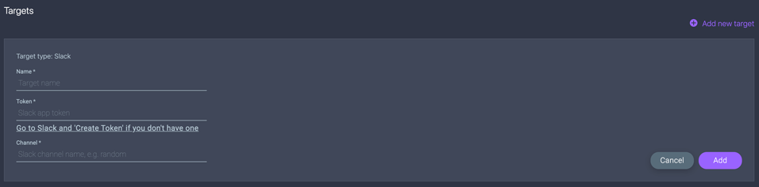
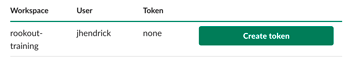
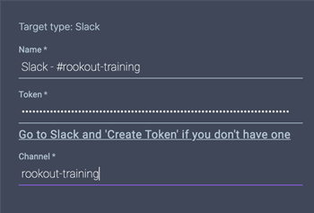
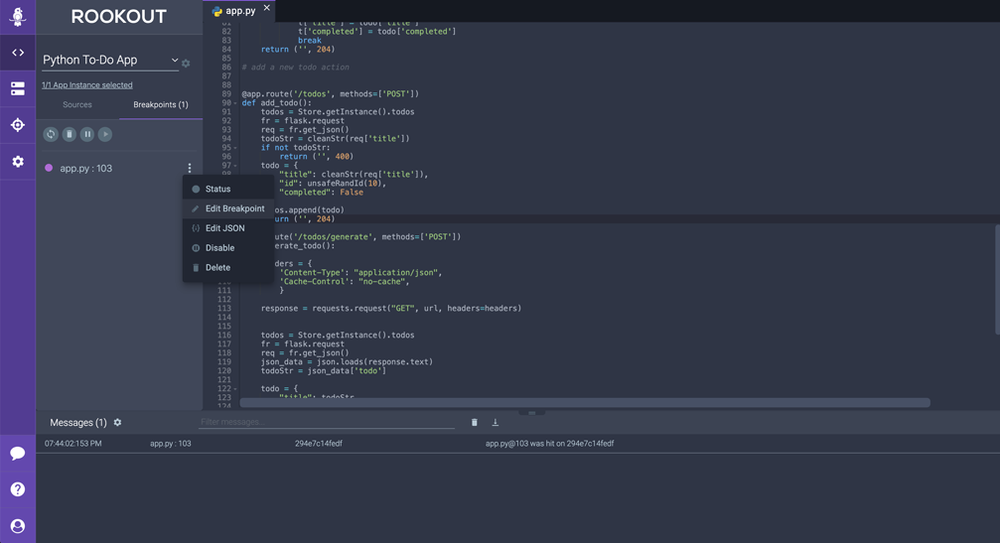
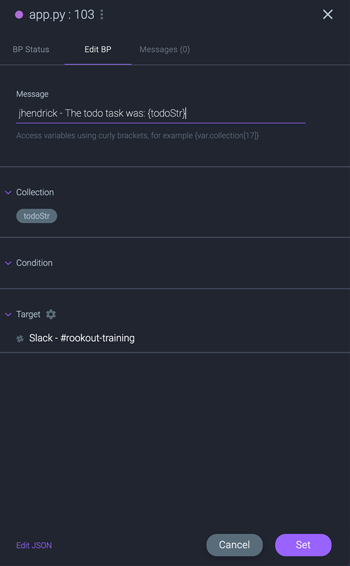
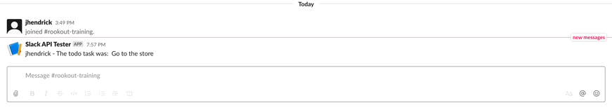

# Rookout Data Targets

In the last few sections we looked at how to set a **Non-Breaking Breakpoint** and then we customized that breakpoint in order to further refine how and when Rookout collects data snapshots.  In this section we'll explore how you can take data from a Rookout snapshot and send it to an external system such as Slack.  Rookout supports sending data to any external target which has an API available.

In this section we'll look at the following:

* How to configure Slack as a **Rookout Target**
* How to configure a **Non-Breaking Breakpoint** to send data to the configured Slack target
* How to customize the message and channel which Rookout will send data to

> Note: You will need a Slack account for this section.  If you haven't yet created one in the setup section, create one now at https://slack.com/get-started.

Let's get started:

1. First, let's setup the **Slack target** by clicking on the **Targets** link from the purple menu bar on the left hand side.  This will bring you to the **Targets configuration page** where you can add a new target.

<p><p>

2.  Click on the **Add new target** button in the top right corner and select **Slack**.  This should bring up the **Slack** configuration screen.

<p><p>

Before proceeding, join the **rookout-training** slack workspace by clicking on this link and following the prompts: https://join.slack.com/t/rookout-training/shared_invite/enQtOTE2MjE0MTczOTUyLWMzY2RhYzRiMzZkMmMzMTMyNjE3ZjVlOGNkNTI2YzBkOTNkYjlhNjUzM2UwNmQ1YzdhY2UwNTk5NzQ0M2UxMzI

Confirm that you can access the **#rookout-training** channel. Once you're a member of the *rookout-training* workspace, you will need to provide the following information to configure the Slack target in Rookout:

* **Name of the Target**: this can by any name you choose.  Let's call it '***Slack - #rookout-training***'
* **Token**: The Slack API Token. Generate an API token by clicking on this link https://api.slack.com/custom-integrations/legacy-tokens and scrolling down until you see the **Create token** button under the rookout-training workspace.  Click **Create token** to generate a token.  You may need to first input your password and click Create token a second time.

    <p><p>

* **Channel**: The Slack channel name to send the message to.  In this case use the slack channel name '***rookout-training***'.  Note that you do not need to include the '*#*' symbol in the name.

    Your configuration should look like this:

    <p><p>

3.  Click the **Add** button to save the configuration.  You should see it appear as a line item in the table below.  If you made a mistake, click the **pencil** icon in the right hand column of the table to edit the configuration.

4.  Now, from the purple menu bar on the left side, click back to the **Debugger** view.  Click the **Breakpoints** tab from the left hand menu and edit the breakpoint by clicking the **three dots** to the right of the breakpoints and selecting **Edit Breakpoints**. 

<p><p>

5.  In the **BP Edit** screen, click on the **Target** box to expand the section and change the drop down from **Rookout** to '***Slack - #rookout-training***'.

6.  Next, we will change the message which gets sent to Slack.  In the **Message** section of the **Edit BP** screen, you should see an existing message that looks something like this:

    ```
    {frame.filename}@{frame.line} was hit on {rook.hostname}
    ```

    Let's adjust the message so that it contains your username and prints out the local variable **todoStr** from the **add_todo** function.  Adjust the message to look something like this:

    ```
    <your-github-username> - The todo task was {todoStr} 
    ```
    Replace `<your-username>` with your GitHub username so that you can differentiate your message from other trainee messages.

    > Note: Notice that you can use the curly brace notation '{ }' in your message which allows direct access to local variables within your application.  In the original message, you'll also notice that you can access internal Rookout namespaces which allow you to access infromation about the Rookout SDK as well as various data elements related to the breakpoint.  To read more on this in the documentation refer to the following link: https://docs.rookout.com/docs/breakpoints-reference/#namespaces

    <p><p>

7.  Click the **Set** buton to save the changes.  Now, switch back to the To-Do application and add another To-Do item to the list.

8.  Switch back to Rookout.  Notice that this time, no new messages appear in the message pane.  Now switch back to the Slack '***#rookout-training***' channel.  You should see your message appear.

    <p><p>

    Congratulations! You've completed the Rookout training workshop.  You're now ready to setup the Rookout SDK within your own applications.  Feel free to browse the rest of the docs at https://docs.rookout.com/docs/welcome.html.

    If you have additional questions or need support you can email support@rookout.com.